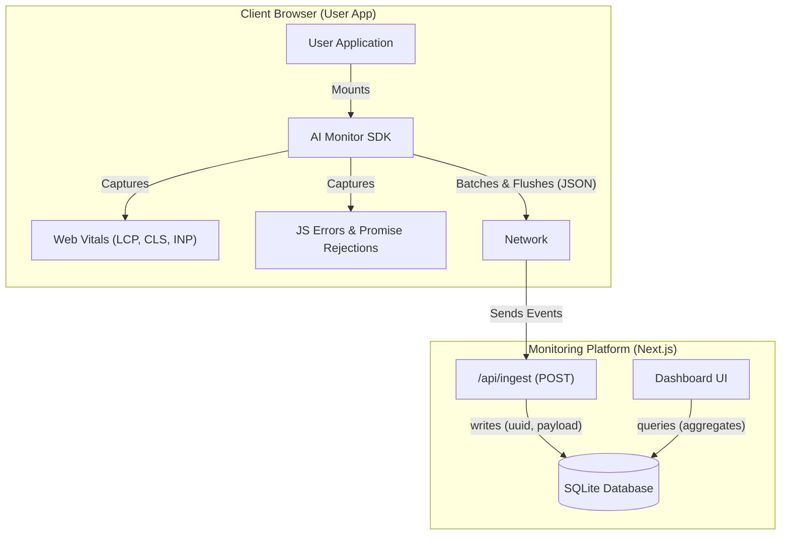

# AI-Powered Frontend Performance Monitor

A self-hosted, full-stack performance monitoring system for modern web applications. Designed to capture Real User Metrics (RUM), JavaScript errors, and provide actionable insights via a dedicated dashboard.

---

## 🏗 High-Level Architecture

The system consists of three main components data flow:

1.  **Client Application**: The user's web app with our lightweight SDK initialized.
2.  **Ingestion & Storage**: A Next.js API route receiving batched events and storing them in an optimized SQLite database.
3.  **Visualization**: A Dashboard for viewing trends, errors, and performance scores.



### 🧠 Diagram Explanation

1.  **Event Capture (Client Side)**:
    *   The **AI Monitor SDK** is mounted in your application.
    *   It automatically listens for **Web Vitals** (via `web-vitals` library) and **JavaScript Errors** (via global event listeners).
    *   Events are buffered locally to avoid spamming the network.
2.  **Data Transmission**:
    *   When the buffer fills or a timer fires, events are batched into a JSON payload.
    *   This payload is sent via a `POST` request to the `/api/ingest` endpoint using `fetch` with `keepalive` to ensure data delivery even during page navigation.
3.  **Ingestion & Storage (Server Side)**:
    *   The **Ingestion API** receives the payload, assigns unique IDs, and validates the data.
    *   Events are written synchronously to the **SQLite Database** for persistent storage.
4.  **Visualization**:
    *   The **Dashboard UI** queries the database to calculate aggregates (e.g., Average LCP, Error Counts) and renders them into interactive charts.

---

## 🚀 Key Features

*   **Real-User Monitoring (RUM)**: Automatically captures Core Web Vitals (LCP, CLS, INP) and Time to First Byte (TTFB).
*   **Error Tracking**: Catches uncaught exceptions and unhandled promise rejections with stack traces.
*   **Smart Buffering**: Events are batched and sent periodically to minimize network overhead.
*   **Privacy-First**: No PII collected by default; data stays on your infrastructure.
*   **Zero-Config Dashboard**: clear, detailed visualization of your app's health out of the box.
*   **Session Replay**: Record DOM mutations (via `rrweb`) to replay interactions leading up to an error.
*   **Source Map Support**: Upload source maps to un-minify stack traces for easier debugging.

---

## 🛠 Tech Stack

*   **Framework**: [Next.js 14+](https://nextjs.org/) (App Router)
*   **Language**: TypeScript
*   **Database**: `better-sqlite3` (Embedded, fast for MVP)
*   **Styling**: Tailwind CSS
*   **Charts**: Recharts

---

## 🏁 Getting Started

### 1. Prerequisites
*   Node.js 18+ installed
*   Git

### 2. Installation
Clone the repository and install dependencies:

```bash
git clone git@github.com:PriyankaSDaida/AI-Powered-Frontend-Performance-Monitor-.git
cd AI-Powered-Frontend-Performance-Monitor-
npm install
```

### 3. Running the Server with Dashboard
Start the development server. This runs both the **Ingestion API** and the **Dashboard**:

```bash
npm run dev
```
Open [http://localhost:3000/dashboard](http://localhost:3000/dashboard) to view the monitoring dashboard.

---

## 🔌 SDK Integration Guide

To monitor your own React/Next.js application, you need to integrate the SDK.

### Option A: Using the Component (Recommended for React)
Copy the `src/sdk` and `src/components/MonitorInit.tsx` to your project and import the component in your root layout.

```tsx
import MonitorInit from '@/components/MonitorInit'; 

export default function RootLayout({ children }) {
  return (
    <html lang="en">
      <body>
        {/* Initialize Monitoring */}
        <MonitorInit />
        
        {children}
      </body>
    </html>
  );
}
```

### Option B: Manual Initialization
If you are using vanilla JS or a different framework, initialize the class directly:

```typescript
import { initMonitor } from './sdk';

initMonitor({
  appId: 'my-awesome-app',
  ingestUrl: 'http://localhost:3000/api/ingest', // Point to your running monitor instance
});
```

---

## 🐳 Database Management

The project uses a local SQLite file named `monitoring.db`.
*   The database is automatically created on the first run.
*   To reset data, simply delete the `monitoring.db` file and restart the server.

```bash
rm monitoring.db && npm run dev
```

---

## 🔮 Future Roadmap

*   **🔔 Alerting System**: Webhook integrations (Slack/Discord) for performance regressions or error spikes.
*   **🌍 Geographic & Device Breakdown**: Visualizations for performance by country and device type.
*   **🤖 AI Insight Generator**: LLM-powered analysis of error clusters to suggest fixes.
*   **🆔 User Identification**: Tag sessions with user IDs for easier support debugging.

---

## 📜 License
MIT
